# 🚀 Automasi SKP Bulanan & Harian - Ekita Kab. HST


Otomatisasi untuk input SKP Bulanan & Harian Pada Ekita Kab. HST.

---

## ✨ Fitur Unggulan

- 🧠 **Smart Session Caching**: Sesi login (`ci_session`) di-cache di lokal. Skrip hanya akan melakukan otentikasi login jika sesi benar-benar sudah kedaluwarsa, mengurangi beban *request* pada server Ekita.
- 🛡️ **Proteksi Keamanan Data**: 
  - Tidak akan menghapus data Harian yang berstatus **"Sesuai"**.
  - Tidak akan menghapus data Target Bulanan yang berstatus **"Disetujui"**.
- 🔄 **Auto-Detect & Fallback**: Skrip otomatis mengecek keberadaan target bulanan. Jika belum ada (atau tidak lengkap), skrip secara mandiri akan membangun *(insert)* header bulanan beserta seluruh turunannya.
- 📅 **Auto-Adjust Tanggal**: Otomatis melewati *weekend* (Sabtu digeser ke Jumat, Minggu digeser ke Senin).
- 🧬 **Grouping Sub-Sekuens (X.Y)**: Mendukung pengisian nilai `kuantitas` versus `proses` secara otomatis berdasarkan posisi grup urutan (entri non-terakhir dikirim sebagai "Proses", entri terakhir membawa "Kuantitas").
- 🤖 **Hermes Agent Ready**: Skrip ini dirancang secara rapi sehingga dapat diintegrasikan langsung sebagai *Skill Automasi* pada asisten AI (Hermes Agent). Anda bisa mengeksekusi input data, mengecek nilai, hingga melakukan penghapusan secara aman cukup lewat ketikan *chat* di Telegram atau WhatsApp!

---

## 🛠️ Instalasi & Persiapan

### 1. Kebutuhan Sistem
Pastikan Python 3.x telah terpasang. Install dependensi yang dibutuhkan:
```bash
pip install -r requirements.txt
```

### 2. Konfigurasi Kredensial
*Copy* file konfigurasi dari *example*:
```bash
cp .env.example .env
```
Isi file `.env` dengan kredensial Anda:
```env
EKITA_BASE_URL=https://ekita.hstkab.go.id
EKITA_USERNAME=nip_anda
EKITA_PASSWORD=password_rahasia_anda
```
*(Catatan: File `.env` dan `data/session.txt` sudah diproteksi oleh `.gitignore` sehingga aman dari kebocoran).*

---

## 🚀 Panduan Penggunaan (CLI)

Skrip dieksekusi melalui terminal dengan opsi parameter interaktif.

### Mode Automasi Utama (Input Data)
Melakukan pengecekan target bulanan, auto-generate payload, dan mengirim 34 aktivitas harian.
```bash
# Automasi untuk bulan Agustus tahun 2026
python skp_automation.py --bulan 8 --tahun 2026

# Simulasi (Preview data tanpa mengirimkannya ke server)
python skp_automation.py --bulan 8 --tahun 2026 --dry-run
```

### Mode Utilitas (Cek & Hapus)
```bash
# Mengecek tabel rekapitulasi nilai dan status persetujuan tahunan
python skp_automation.py --tahun 2026 --cek nilai

# Menghapus seluruh entri SKP Harian bulan tertentu (Aman dari status 'Sesuai')
python skp_automation.py --bulan 8 --tahun 2026 --del harian

# Menghapus target SKP Bulanan bulan tertentu (Aman dari status 'Disetujui')
python skp_automation.py --bulan 8 --tahun 2026 --del bulanan
```

*(Jika skrip dijalankan tanpa parameter, layar Bantuan / `--help` akan otomatis ditampilkan).*

---

## ⚙️ Arsitektur & Alur Kerja

Di bawah ini adalah ilustrasi alur kerja cerdas dari skrip saat berjalan pada Mode Automasi Utama.

```mermaid
graph TD
    A["[01] LOGIN / CEK SESI<br/>GET / & POST /c_main/validasi"] --> B["[02] GET ID SKP TAHUNAN"]
    B --> C["[03] GET ID TARGET SKP<br/>(SKP 1 & SKP 2)"]
    C --> D{"[04] CEK BULANAN<br/>Apakah Bulan Ini Ada?"}

    D -- "BELUM ADA" --> E["[05-12] INSERT TARGET BULANAN<br/>(Header & Turunan SKP)"]
    D -- "SUDAH ADA" --> F["[13] GET TARGET BULAN<br/>(Ambil Mapping ID dari Server)"]
    
    E --> F
    
    F -- "Kosong (Fallback)" --> E
    F -- "Sukses" --> G["[14] BUILD PAYLOAD<br/>Load JSON, Hitung Tanggal, Grouping X.Y"]
    
    G --> H["[15] INSERT SKP HARIAN<br/>POST /c_user/aksi_harian_skp × 34"]
    H --> I["[16] READ LIST<br/>Verifikasi Hasil & Tampilkan Tabel"]

    style A fill:#2d3436,stroke:#fff
    style D fill:#d35400,stroke:#fff
    style G fill:#0984e3,stroke:#fff
    style H fill:#27ae60,stroke:#fff
```



---

## 📁 Struktur Template Data

Skrip mengambil parameter isian dari dua file template di dalam folder `data/`:

### 1. `target_bulanan.json`
Berisi uraian kegiatan/deskripsi target bulanan (SKP 1 dan 2). Template ini dibuat **per bulan** (kunci `"1"` untuk Januari hingga `"12"` untuk Desember) sehingga Anda dapat memodifikasi deskripsi kegiatan per bulan tanpa mengubah skema utama.

### 2. `skp_harian.json`
Array berisikan 34 struktur rencana kegiatan harian. Parameter waktu dibuat dinamis (hari dan minggu), bukan tanggal mutlak, sehingga file ini bisa digunakan **berulang-ulang setiap bulan**.

```json
[
  {"kode":"1.b", "minggu":1, "hari":"Rabu", "seq":1, "kegiatan_harian_skp":"Kegiatan 1.b - 1.1", "kuantitas":"1"},
  {"kode":"1.b", "minggu":1, "hari":"Kamis", "seq":1, "kegiatan_harian_skp":"Kegiatan 1.b - 1.2", "kuantitas":"1"}
]
```

---

## 🛡️ Catatan Keamanan & Troubleshooting

Sistem telah di-*refactor* secara masif untuk menjamin tingkat keberhasilan 100% pada *Environment* produksi:

1. **Bug Initial Cookie**: Teratasi. Sistem mengeksekusi `GET /` sebelum `POST` login untuk memastikan *handshake* form CodeIgniter sukses.
2. **Dynamic Indexing DataTable**: Pembacaan ID (*scraping*) tidak lagi bergantung pada *hardcode* indeks Array. Menggunakan *Regex Sweeper* yang menjamin ID dari tabel HTML tetap tertangkap meski admin Ekita menambah/menggeser kolom.
3. **Regex Quote Escaping**: Parameter fungsi Javascript `onclick="ubah_target_bulanan_skp('ID')"` sudah ditangani menggunakan Regex kutip satu.
4. **Form-Urlencoded Strict**: Payload operasi CRUD (*Insert* dan *Delete*) dipastikan dikirim dalam format *x-www-form-urlencoded* menggunakan modul `raw=`, menyesuaikan aturan mutlak di *backend* CodeIgniter Ekita yang seringkali gagal membaca `application/json`.
